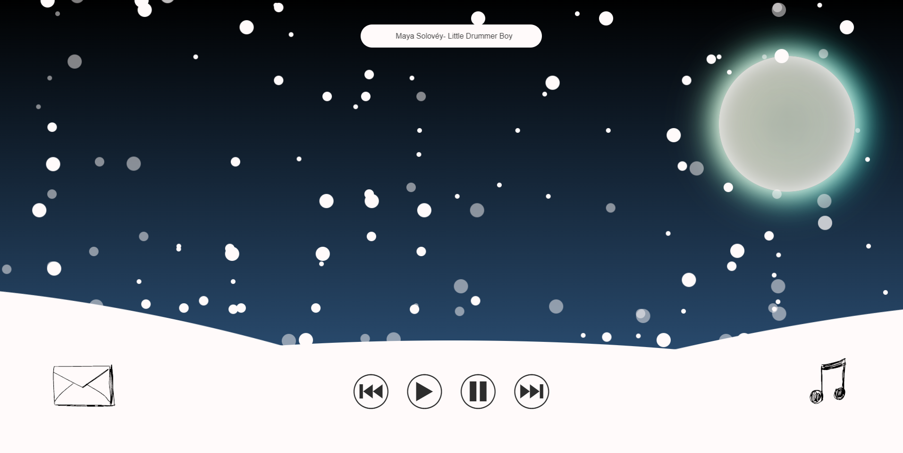

# Winter Theme

## Table of Contents
* [Description](#description)
* [Usage](#usage)
* [Questions](#questions)

## Description
Using HTML, CSS, and JavaScript, this project serves as a winter themed digital holiday card. Feel free to use for personal use.

## Usage
Audio can be toggled on and off with options to pause, play previous, or skip to next song. Currently contains 5 songs. Also, there's an envelop with something inside.

## Questions
Follow me on [Github](https://github.com/Kayvonk).

To contact me, send an email to kayvonk@gmail.com with your name and inquiry.

Deployed Application: https://kayvonk.github.io/holiday-theme/
